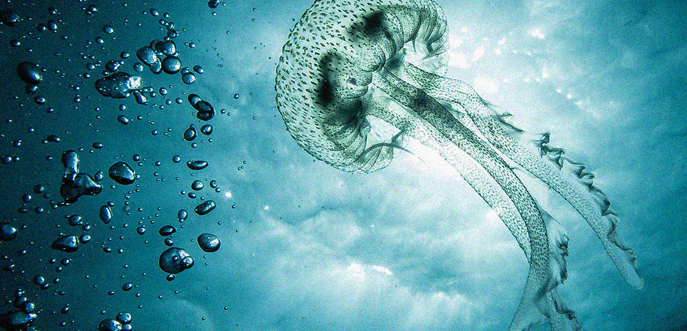
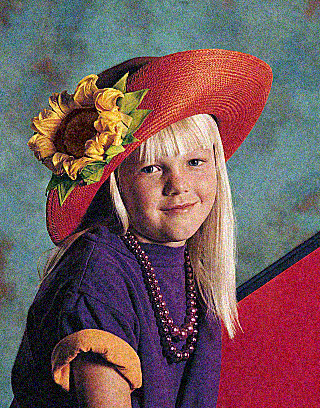
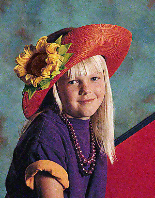
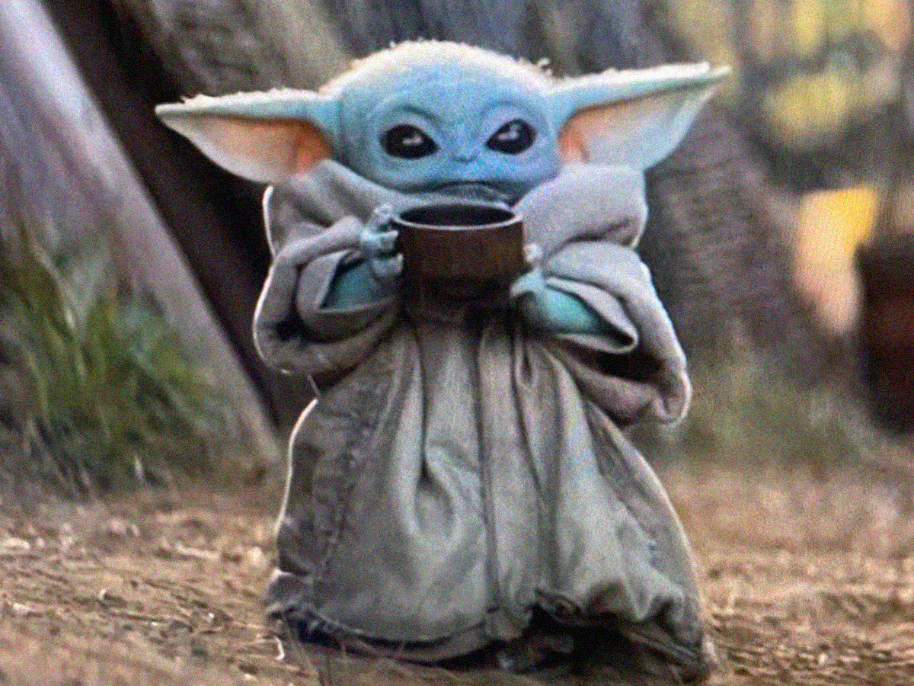

# [knnimdenoiser](https://github.com/ImageProcessing-ElectronicPublications/knnimdenoiser) demo

KNN image denoise is image denoising using K Nearest Neighbors filter.

## Overview

This application uses a K Nearest Neighbors filter to remove noise from images.
The project was based on [this paper](https://developer.download.nvidia.com/compute/cuda/1.1-Beta/x86_website/projects/imageDenoising/doc/imageDenoising.pdf).

## Example images before and after denoising process:

Noisy image                |  Fixed image
:-------------------------:|:-------------------------:
  |  
  |  
  |  
